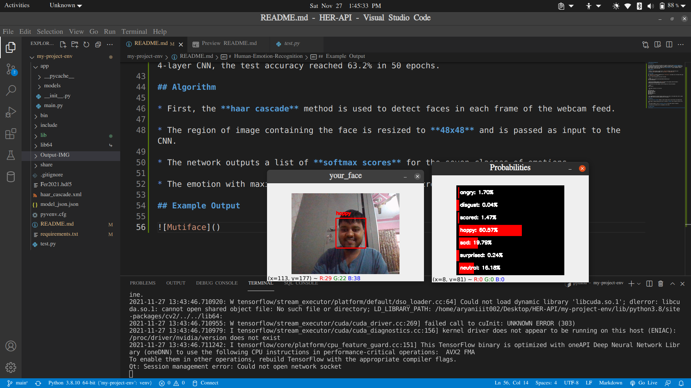
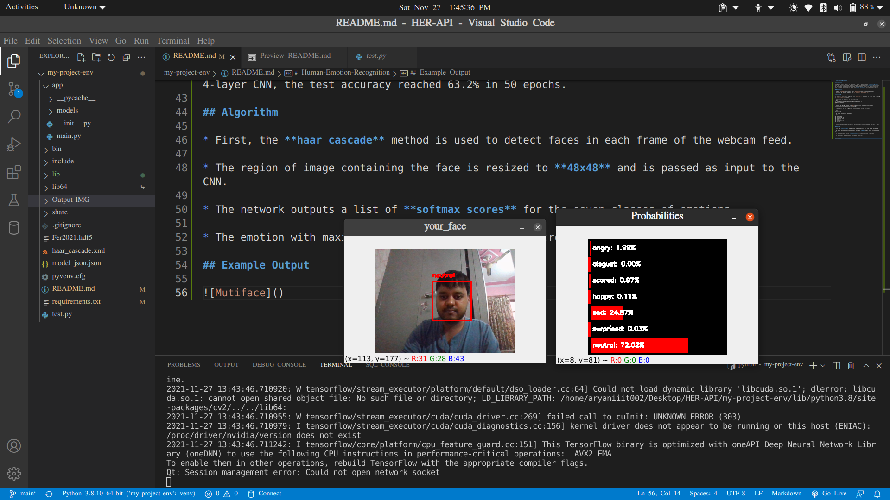

# Human-Emotion-Recognition

## Introduction

This project aims to classify the emotion on a person's face into one of **seven categories**, using deep convolutional neural networks. The model is trained on the **FER-2013** dataset which was published on International Conference on Machine Learning (ICML). This dataset consists of 35887 grayscale, 48x48 sized face images with **seven emotions** - angry, disgusted, fearful, happy, neutral, sad and surprised.

## Dependencies

* Python 3, [OpenCV](https://opencv.org/), [Tensorflow](https://www.tensorflow.org/)
* To install the required packages, run `pip install -r requirements.txt`.

## Basic Usage

The repository is currently compatible with `tensorflow-2.0` and makes use of the Keras API using the `tensorflow.keras` library.

* First, clone the repository and enter the folder

```bash
git clone https://github.com/atulapra/Emotion-detection.git
cd Emotion-detection
```

* Download the FER-2013 dataset from [here](https://drive.google.com/drive/folders/1xHRBopJdeZwB7VDcaWmzM3qGBTmeETZX?usp=sharing).

* If you want to run this program, use this inside your virtual environment:  

```bash
python test.py
```

* The folder structure is of the form:  
  src:            
.           
├── Fer2021.hdf5                 
└── haar_cascade.xml       
└── model_json.json               
└── pyvenv.cfg           
└── requirements.txt                 
└── test.py


* This implementation by default detects emotions on all faces in the webcam feed. With a simple 4-layer CNN, the test accuracy reached 63.2% in 50 epochs.

## Algorithm

* First, the **haar cascade** method is used to detect faces in each frame of the webcam feed.

* The region of image containing the face is resized to **48x48** and is passed as input to the CNN.

* The network outputs a list of **softmax scores** for the seven classes of emotions.

* The emotion with maximum score is displayed on the screen.


## Example Output

               
           
                 